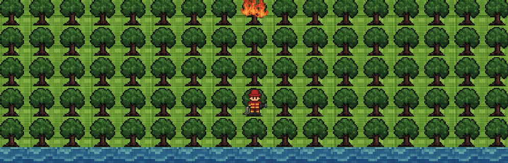

# 🌳🔥 Fire Combat - Jogo do Desafio 5 | Trilhas Inova Maranhão

## 🎮 Visão Geral

Este projeto foi desenvolvido como parte do **Desafio 5 do Programa Trilhas Inova Maranhão**, na trilha de **Desenvolvimento de Jogos**. O desafio propõe a criação de soluções tecnológicas criativas e engajadas com os problemas reais do estado do Maranhão.

## 🌎 Contextualização

O **Programa Trilhas** busca capacitar jovens maranhenses em áreas estratégicas como Desenvolvimento de Jogos, Front-End, Back-End, UX Design e Ciência de Dados. O objetivo é proporcionar experiências práticas e transformadoras, que articulem conhecimento técnico com impacto social.

A trilha de Desenvolvimento de Jogos estimula a criação de games que unam entretenimento, reflexão e conscientização, abordando temáticas relevantes para a realidade do Maranhão.

## 🔥 Temática

O tema escolhido é **queimadas no Maranhão**, um problema ambiental grave e recorrente no estado. As queimadas, muitas vezes ligadas ao desmatamento e práticas agrícolas insustentáveis, geram impactos sociais, econômicos e ecológicos severos, afetando principalmente comunidades tradicionais e vulneráveis.

O jogo busca **sensibilizar e informar** sobre esse problema por meio de uma experiência interativa e educativa.

## 💡 Ideia do Jogo

Você é um bombeiro florestal em uma floresta ameaçada pelo fogo. Seu objetivo é:

- Apagar focos de incêndio que surgem aleatoriamente;
- Coletar água em pontos do mapa para apagar as chamas;
- Impedir que o fogo se alastre;
- Plantar brotos onde árvores foram destruídas;
- Responder perguntas para ganhar **power-ups**;
- Salvar o maior número possível de árvores!

## 🕹️ Mecânicas

### ✅ Movimentação
- Sistema em grid (células).
- Use `WASD` ou as **setas direcionais** para se mover (uma célula por vez).
- Você pode se mover livremente sobre árvores saudáveis.

### ✅ Queimadas
- As árvores pegam fogo aleatoriamente.
- O fogo pode se espalhar para células vizinhas se não for controlado.
- Você não pode se mover por árvores em chamas.

### ✅ Combate ao Fogo
- Clique com o **botão esquerdo** do mouse e segure para coletar água.
- Vá até a célula em chamas, clique com o **botão esquerdo** e segure para apagar o fogo.
- A árvore em chamas se transformará em uma árvore queimada, ela é imune ao fogo, mas você não pode mais se mover sobre ela.

### ✅ Plantar Brotos
- Clique com o **botão esquerdo** do mouse sobre uma árvore queimada e segure para plantar um novo broto no lugar.
- Brotos são imunes ao fogo e você pode se mover sobre eles.
- Depois de um tempo, os brotos crescerão e voltarão a ser árvores saudáveis.

### ✅ Power-ups
- Durante a partida, surgem **perguntas de verdadeiro ou falso** com um tempo limitado para serem respondidas.
- Ao acertar, você ganha um **poder especial**: Chuva! Ela apaga o fogo em uma área ao redor da célula escolhida.

## 🧱 Design e Arte

- Estilo visual: **Pixel art 2D**, com estética retrô de 16 bits.
- Elementos no grid: árvores, brotos, água, fogo, personagem bombeiro.
- Apenas um personagem jogável: **Bombeiro florestal**, com traje vermelho e amarelo.

## 🏆 Pontuação e Recompensas

- Pontos por:
  - Apagar incêndios;
  - Plantar brotos;
  - Acertar perguntas.
- Bônus extra ao vencer com árvores saudáveis restantes.
- Derrota se **todas as árvores e brotos forem destruídos**.
- Tela final mostra:
  - Resultado (vitória/derrota);
  - Pontuação total;
  - Histórico de partidas e ranking.

## 🌲 Fase

- O jogo conta com uma única fase, em um mapa fixo representando uma floresta. Focos de incêndio se espalham ao longo do tempo, exigindo que o jogador se mova com estratégia para apagar o fogo e coletar água.

## 🖥️ Interface

- Menu principal com:
  - Novo Jogo
  - Sair
- Durante o jogo:
  - Pontuação no canto superior direito;
  - Perguntas aparecem com contagem regressiva.
- Tela final mostra:
  - Pontuação;
  - Ranking ou opção de tentar novamente.

## 💻 Onde Jogar

- Acesse o link do nosso jogo no ITCH IO: [link](https://matheus-serra.itch.io/fire-combat)

---
